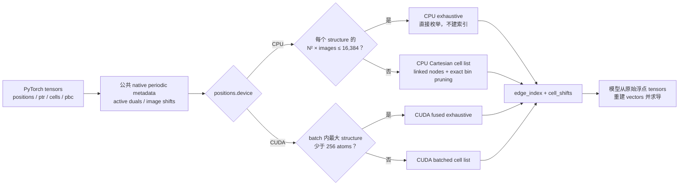

# 算法总览：一个接口，两套为硬件而生的搜索路径

本文面向希望快速判断方案价值、技术路线和适用边界的读者。实现细节见[当前设计](design.md)，完整测量方法见[真实材料 benchmark](benchmark.md)，问题修复与独立验证见[终审记录](review.md)。

## 一句话结论

这个实现没有发明新的 neighbor-search 数学，而是把成熟的 exhaustive search 与 cell-list 思想重新组织成一套 PyTorch-native 系统：公共层只定义一次 periodic geometry 和 graph semantics，CPU 与 CUDA 各自选择符合硬件成本模型的执行方式。CPU 重点压低单 structure、尤其小晶体的一次性调用成本；CUDA 重点让整个 heterogeneous batch 共同占满 GPU，并避免任何 `N² × images` 中间 tensor。

在 AMD Ryzen Threadripper PRO 9975WX 的单个固定 core 上，CPU backend 对 1,536 个 `matbench_mp_e_form` 真实晶体组成的 `batch_size=1` DataLoader epoch 用时 123.10 ms，而复用同一个 Vesin `NeighborList` 的公平 baseline 为 248.71 ms，前者快 2.02×。单个 64-atom 与 512-atom structure 也分别快 1.32× 和 1.40×；从 1,728 atoms 起 Vesin 的成熟 cell list 领先，说明我们的优势是常见小/中体系与低 boundary overhead，而不是所有尺度上的无条件胜利。

既有 CUDA 结果同样保持：NVIDIA RTX PRO 6000 Blackwell 上，1,536-structure epoch 相对逐 structure Vesin GPU 快 14.74×，代表性 32-structure batch 相对 Equiformer/FairChem-style dense 构图快 47.07×。这些数字是固定硬件、软件与 workload 的工程证据，不是跨平台保证。

## 它解决的问题

等变原子图模型需要在 cutoff 内构造完整的有向 periodic atom-image graph。每条 edge 除了 source 和 target atom index，还必须返回整数 cell shift；图不能跨越 batch member，必须保留 periodic self-images 和 small cell 中的 multiple images，并正确处理 triclinic cell、partial PBC、rank-deficient active lattice、cutoff boundary、unwrapped representatives 与 autograd 边界。

最直接的 dense 算法会枚举 `N² × periodic images`。它在小体系上往往胜在简单，却会随原子数二次增长。Cell list 把空间分桶，在固定 density、cutoff 和邻居数时接近 `O(N + E)`，但建表本身也有固定成本。真正的工程问题因此不是“哪一种算法永远更好”，而是如何可靠地判断何时切换，以及如何让几何准备、内存分配、Python/C++ boundary 和 batch execution 不吞掉理论收益。

## 整体数据流

公共 API 不根据 device 改变 shapes、dtype 或物理含义。不同的只是内部调度：CPU 按 structure 顺序执行，CUDA 把整个 batch 编入一次 pipeline。这样上层模型不需要维护“CPU 语义”和“GPU 语义”两套代码。

## 主要优化技巧

### 1. 把公共几何从 device algorithm 中拆出来

CPU 和 CUDA 都需要 active-cell rank 检查、dual lattice、image ranges 与 image shifts。它们现在由始终可构建的 native C++ CPU extension 计算一次，再交给 device-specific search；CUDA-only block/node schedule 则单独生成。这个拆分避免 CPU backend 被迫理解 CUDA grid，也避免两边各写一套容易漂移的 periodic convention。

这项重构本身就是 CPU 最重要的性能优化。早期版本通过多次 Python/Torch 小算子构造 metadata，真实 epoch 为约 285.7 ms；把 1–3 维线性代数和 image enumeration 收进一次 native call 后降到最终约 123.1 ms。这里没有神奇 SIMD，收益来自消除 1,536 次调用上重复的 Python dispatcher 与小 tensor overhead。

### 2. CPU crossover 看候选数，不只看 atom 数

CPU exhaustive 的真实工作量是 `N² × image_count`，同样 32 个 atoms 在 finite 与 tiny periodic cell 中成本完全不同。因此 CPU 不使用一个粗糙的 atom threshold，而是对每个 structure 计算候选数；不超过 16,384 时直接穷举，超过时建立 cell list。

16,384 来自同一 Matbench epoch 上的 threshold sweep：2,048、8,192、16,384、32,768、131,072 对应约 138.8、115.4、115.0、117.0、162.2 ms。它是当前 workstation evidence 下的 provisional choice，不是数学常数，也不进入 correctness tests。

### 3. CPU cell list 只保存真正相关的 periodic images

大体系把 wrapped source images 插入边长等于 cutoff 的 Cartesian bins，但只有落在 target representatives bounding box 外扩一个 cutoff 范围内的 images 才成为 linked nodes。每个 target 最多访问相邻 `3×3×3` bins，并用 target 到 bin AABB 的精确最短距离提前排除 cutoff sphere 不可能相交的 corner bins。这样既不枚举全部 atom pairs，也不为很远的 periodic images建节点。

实现使用 dense bin-head array 和紧凑 int32 linked nodes。对于极端稀疏 finite coordinates，若 dense grid 相对真实 image 数过大，就回退 exhaustive，避免为一片空空间分配病态内存。这是显式工程安全边界，不是物理 tolerance。

### 4. CPU native call 释放 GIL，但不偷偷抢线程

CPU search 在 C++ 中完成并通过 pybind call guard 释放 Python GIL，因此其他 Python threads 不会被这次 native calculation 无谓阻塞。Backend 本身保持单线程：这使一次调用的资源成本可预测，也适合 DDP 或 DataLoader workers 已经进行进程级并行的训练环境，避免 `workers × backend threads` oversubscription。Benchmark 中 Vesin 同样明确设置 `n_threads=1`。

### 5. CUDA batch-first，而不是逐体系循环

`ptr` 直接描述每个 structure 的 atom segment，不同 atom counts、cells 和 PBC patterns 可以进入同一次 CUDA launch sequence。GPU 不再为几十个小体系反复启动、同步和拼接；算法只在每个 segment 内产生 pairs，因此不会把整个 batch 的总 atom 数一起平方，更不会产生跨体系 edges。

### 6. CUDA 小体系使用融合穷举，大体系使用 warp cell list

小于 256 atoms 时，CUDA 把 `(source, target, image)` candidates 直接映射到 threads，以 block reduction 计数、block scan 写出，不 materialize dense candidate tensors。大体系先建立 batched Cartesian cell list，每个 warp 负责一个 target，由前 27 个 lanes 扫描相邻 bins。固定 density 时工作量接近 `O(N + E)`，而物理输出若本身达到 `O(N²)`，任何正确算法都无法绕过该下界。

### 7. 精确分配与错误报告复用必要同步

CUDA edge 数事先未知，因此先 count、再精确分配、最后 write。NaN/Inf、representative wrap 越界和 int32 shift 越界被编码进已有状态位置，通过本来就需要的 host read 一并报告，避免额外同步。CPU 则直接用 native vectors 收集结果并一次复制到精确大小的 PyTorch tensors；两边都没有先制造巨大候选 tensor 再过滤。

### 8. 用真实材料和失败实验约束优化欲望

CPU 曾尝试更细的 `cutoff/2` bins：访问候选从约 222 万降到 114 万，32,768-atom query 却因需要遍历更多 bins 从约 19 ms 退到 36 ms；也尝试只计算一半反向对称 pairs 后成对写出，端到端从约 18.5 ms 退到 20.9 ms。两项都已撤回。CUDA 也曾把融合 atomic bounds 改成独立 CUB reductions，kernel 名称更“高级”，wall time 却更差。这个仓库把失败结果写进日志，因为性能工程最重要的能力不是产生优化点子，而是果断否决没有端到端收益的点子。

## 与 Equiformer 和 Vesin 的关系

| 方案 | 主要执行单位 | 小体系 | 大体系 | 定位 |
| --- | --- | --- | --- | --- |
| Equiformer/FairChem periodic dense pattern | PyTorch batch | `N² × images` tensor 展开 | 仍然展开 | 模型内通用张量实现 |
| Vesin CPU/GPU | 单个 structure | Auto 选择 | 成熟 cell list | 通用 neighbor-list library |
| 本实现 CPU | 单个或 batched Torch input，内部逐 structure | candidate-aware exhaustive | 单线程 Cartesian cell list | 低 PyTorch boundary overhead、统一 API |
| 本实现 CUDA | 整个 PyTorch batch | Fused exhaustive | Batched warp cell list | 模型入口的高吞吐 builder |

本实现没有复制或移植 Vesin 源码。CPU 大体系与 Vesin 都属于 cell-list 家族，小体系也都承认建索引未必值得；差异在 periodic image 表示、data layout、crossover、PyTorch boundary 和具体实现成熟度。CUDA 的根本差异则是 batch-first execution。类似两个数据库都使用 B-tree，算法家族相同并不意味着执行成本相同。

## 真实性能证据

### CPU：单 structure DataLoader workflow

| Workload | 本实现 CPU | Vesin CPU reused | Vesin / 本实现 |
| --- | --: | --: | --: |
| 1,536-structure epoch | 123.103 ms | 248.713 ms | 2.02× |
| 真实结构，64 atoms | 0.0348 ms | 0.0457 ms | 1.32× |
| 派生 supercell，512 atoms | 0.1643 ms | 0.2297 ms | 1.40× |
| 派生 supercell，1,728 atoms | 0.8525 ms | 0.7150 ms | 0.84× |
| 派生 supercell，32,768 atoms | 20.1076 ms | 13.0951 ms | 0.65× |

CPU benchmark 使用 float64、5 Å cutoff、固定 core 31、双方单线程、每个 backend/workload 2 秒 warmup，并保存全部 samples。Epoch 的胜利来自 1,536 次常见小晶体调用的低固定成本；大 supercell 的落后则说明进一步优化 CPU cell list 仍有空间。

### CUDA：heterogeneous batch workflow

| Workload | 本实现 CUDA | Vesin GPU/structure | Equiformer-style dense |
| --- | --: | --: | --: |
| 1,536-structure DataLoader epoch | 36.584 ms | 539.100 ms | skipped |
| 32-structure 代表 batch | 0.918 ms | 9.970 ms | 43.215 ms |
| 单个真实 64-atom 晶体 | 0.241 ms | 0.386 ms | 0.701 ms |
| 32,768-atom 派生 supercell | 0.414 ms | 1.607 ms | 候选约 290 亿，跳过 |

CUDA 的主要优势来自把 batch 作为执行单位；CPU 结果与 CUDA 结果回答不同问题，不能用同一倍数互相替代。

## 为什么适合在模型入口动态构图

推荐 Dataset 只保存 atomic numbers、positions、cell、PBC 和 labels；batch 到达模型后，由模型拥有的 graph builder 根据自身 cutoff 构图。这样 cutoff、self-edge policy 和 receptive field 不会污染 Dataset schema，数据增强、结构扰动、MD 和不同模型配置也不会读到 stale graph。

在 CPU 数据管线中，如果训练最终在 GPU 上执行，通常仍应先把 graph-free batch 一次 transfer 到 CUDA，再调用 CUDA backend；CPU backend 更适合 CPU inference、预处理/诊断、无 GPU 环境，以及 ELFES 当前 NumPy/CPU two-center workflow 的未来 adapter。固定结构反复推理时 prepared metadata 仍可能有价值，但它应成为明确的可选 API，而不是 Dataset 隐式携带 cutoff-specific graph。

## 为什么可以信任结果

Production output 不依赖 edge order，而是按完整 `(source, target, Sx, Sy, Sz)` key set 验证。独立 exhaustive PyTorch reference、ASE triclinic partial-PBC case、Vesin 0.6.1 external reference、44 项 CPU/CUDA tests、随机差分、autograd backward、non-default CUDA stream 和 CUDA memcheck 共同覆盖两套路径。全部 1,536 个真实结构、2,780,158 条 edge keys 在 CPU 上与 Vesin 精确一致；CUDA 正式记录也通过同一 corpus。

## 已知边界

- CPU search 当前为单线程，batch 内 structures 顺序处理；它有意不隐式创建 thread pool。
- CPU 在常见小/中结构上有优势，但其 large-system cell list 仍慢于 Vesin；不要把 epoch 2.02× 外推到 1,728+ atom single structures。
- Public `cell_shifts`、representative periodic wraps 和 cell-list nodes 使用 int32 可表达范围；越界直接报错，不进行静默截断。
- One-shot API 每次重建少量 metadata；静态 topology 可能从 prepared metadata API 获益，但 ownership 与 mutation invalidation 尚需设计。
- 极小非空 periodic cell 可能包含大量真实 periodic images，metadata 和输出会随物理 edge 数增长。
- CPU 16,384-candidate 与 CUDA 256-atom crossovers 都是当前 workstation evidence，不是 correctness contract 或普适阈值。

## 最终判断

这个方案真正的“独门技巧”不是某一个奇特 kernel，而是把成本放在正确层次上思考：公共几何只做一次，小体系不为索引付费，大体系不为 `N²` 付费，CUDA batch 不为逐体系 launch 付费，CPU 不为 Python 小算子付费，安全检查不制造额外同步，所有优化都必须同时通过真实材料 correctness 与 wall-time 证据。最终得到的不是一个 CUDA prototype 外挂 CPU 补丁，而是一套从公开语义到 build layout 都把 CPU 与 CUDA 当作一等公民的 radius-graph system。
