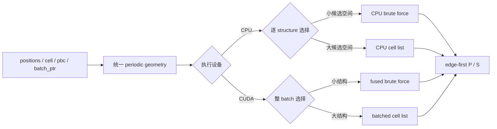

# 算法总览

本文介绍项目解决什么问题、为什么同时使用 brute force 和 cell list，以及 CPU 与 CUDA 如何围绕不同硬件组织同一套 neighbor-search 语义。实现边界见[架构介绍](architecture.md)，自动选择规则见[算法选择](algorithm-selection.md)，精确约定见[设计文档](design.md)，测量方法与完整数字见[benchmark](benchmark.md)。

## 要解决的问题

给定一个或一批有限/周期结构，需要找出 cutoff 内的所有 atom-image pairs。每个结果包含 source、target，以及施加在 target 上的整数 cell shift。最终 displacement 为：

```text
positions[target] - positions[source] + cell_shift @ cell
```

一个正确的实现不能只处理正交晶胞和已经 wrap 的坐标，还要覆盖 triclinic cell、partial PBC、rank-deficient inactive rows、multiple images、periodic self-images、strict cutoff 和不同大小结构组成的 batch。

## 两种互补的搜索方式

最直接的 brute-force search 枚举每个 source、target 和相关 periodic image。它的工作量随原子数近似二次增长，但循环简单、数据连续，不需要先建立空间索引，因此在小体系上通常最快。

Cell list 把空间划分为与 cutoff 同量级的 bins，每个 source 只查询附近 bins。固定 density、cutoff 和平均邻居数时，其工作量接近 `O(N + P)`，其中 `P` 是必须输出的 pair 数；代价是建表、额外内存和更复杂的访问模式。

项目不把其中一种算法当作永远正确的答案，而是根据候选规模选择路径：小体系避免索引开销，大体系避免 `N²` 枚举。



## 统一的周期几何

CPU 与 CUDA 首先从 `cell` 和 `pbc` 得到 active periodic directions、dual vectors 和必须考虑的 image shifts。算法不要求完整 `3×3` cell 可逆，因此 finite system、wire、slab 和 full-periodic crystal 使用同一套输入模型。

原子坐标不要求预先 wrap。搜索内部可以使用 wrapped representatives 提高数值稳定性和空间局部性，但返回的 cell shift 会补偿这次变换，保证调用者始终能用原始 positions 重建相同的物理 displacement。

Periodic image enumeration 只决定搜索范围；最终 pair identity 始终由公开 displacement 和 strict cutoff 决定。这样 brute force、cell list、CPU 和 CUDA 即使采用不同的 broad phase，也不会拥有不同的物理定义。

## CPU 路径

CPU 按 structure 独立选择算法。常见小体系直接进入紧凑的 native brute-force loop，避免 Python 小算子、临时张量和 cell-list 初始化。

大体系使用 Cartesian cell list。算法先 wrap representatives、建立 source 区域的 bins，再把可能进入 cutoff 范围的 periodic target images 插入对应 bin。每个 source 只扫描相邻 bins，并对候选执行最终 strict predicate。极端稀疏坐标若会产生不合理的空 bin grid，则回退到不需要该分配的路径。

CPU backend 本身保持单线程。并行度由调用方在 DataLoader workers、进程池、DDP 或更高层 workflow 中决定，避免 backend threads 与外层并行相互叠加。

### CPU 大体系的设计取舍

Cell list 不只有一种周期表示。当前实现把可能进入搜索区域的 periodic target images 放入 Cartesian bins；另一种常见设计是每个物理原子只入表一次，在查询越过周期边界的 neighboring bins 时再生成 cell shift。Vesin 是后一种设计的成熟例子；其 CPU implementation 减少了 image preparation，bin 内访问更连续，并会在重复调用间复用 output capacity。

真实 scaling 确认了这种差异：32,768 原子时当前实现约 24.1 ms，Vesin 约 13.1 ms。但两者都已经使用接近 `O(N + P)` 的 cell list；当前路径没有退化为穷举，绝对时间仍很小。更常见的 Matbench 小结构分布中本项目 CPU 更快，QMugs 自然分子分布上二者基本打平，因此大型单体系的差距目前不是主要 workload 的瓶颈。

项目现阶段选择保留当前设计。它已经在 CPU/CUDA 上形成相近的 periodic-image 数据流和充分验证的公共 shift 语义，继续重构会增加 partial PBC、multiple images、unwrapped representatives 与 half/self policy 的维护成本，却没有对应的真实使用需求。CPU 与 CUDA 并不被要求永远采用相同算法；如果未来 profile 显示数千原子以上的 CPU-only search 成为端到端瓶颈，再从本项目的接口与数据布局出发重新设计这一层。

## CUDA 路径

CUDA 把整个 heterogeneous batch 作为一次执行单位。`batch_ptr` 把拼接的 positions 划分为独立 structures，kernels 根据这些边界找到每个任务所属的 cell 与 PBC；任何 pair 都不会跨结构产生。

小结构走 fused brute-force path：候选直接映射到 CUDA threads，不构造 `N²` candidate tensors。大结构走 batched cell-list pipeline：整个 batch 共同完成 wrapping、bin construction、periodic image insertion 和 source queries。不同大小的结构共享 launches，因此 GPU 不必在 Python 中逐结构循环。

这也是 CUDA 相对通用单结构 neighbor-list API 的主要优势。它不是让单个距离公式更快，而是让完整 batch 只跨越一次 Python/native 边界，并让许多小体系共同填满 GPU。

## Full、half 与 self

默认输出是排除 zero-shift self 的 full directed list，适合普通 message passing。`half_list=True` 对 `(source, target, S)` 和 `(target, source, -S)` 只保留 canonical 一侧，适合对称 pair interaction。`include_self=True` 为每个原子增加一个 zero-shift self pair，但不会影响 `(i, i, S != 0)` periodic self-images。

这些选项在 native candidate policy 中生效，不是先生成完整结果再由 Python 过滤，因此 half list 会真实减少距离计算、输出写入和内存使用。

## 性能来自哪里

项目的性能不是来自新的 neighbor-search 数学，而是来自几项组合决策：

- 小体系直接 brute force，大体系才建立 cell list。
- Periodic geometry、算法选择和搜索都在一次 native call 内完成。
- CUDA 以完整 batch 而不是单 structure 为调度单位。
- CPU 不 materialize candidate tensors，CUDA 不 materialize padded `N² × images` tensors。
- NumPy 与 Torch CPU 共用一份 native CPU search，framework 适配不会复制算法。

真实结果与这个定位一致。Matbench 晶体中，CPU 在以小结构为主的完整 epoch 上快于单线程 Vesin，但在数千到数万原子的单体系上，Vesin 更成熟的 CPU cell list 占优；32,768 原子时本项目约 24.1 ms，Vesin 约 13.1 ms。QMugs 自然分子分布上二者基本打平。CUDA 则在真实 batch workflow 中明显受益于 batch amortization。

因此项目的目标不是在所有尺度上击败专用 neighbor-list library，而是在常见 NumPy/PyTorch 工作流中提供统一语义、低调用开销和可预测的扩展方式。

## 在模型中的位置

对于 GNN/PyG workflow，推荐 Dataset 只保存 atomic numbers、positions、cell、PBC 和 labels。Batch 到达模型后，由模型根据自身 cutoff 调用 `neighbor_list("PD", ...)`，再在 adapter 边界把 edge-first `P` 转置为 `edge_index`，把 `D` 映射为 `edge_vectors`。

这样 Dataset 不需要携带模型特定的 cutoff，数据增强、结构扰动、MD 和不同模型配置也不会读取过期 connectivity。GPU 训练通常应先把 graph-free batch 一次传到 CUDA，再执行 neighbor search。

## 正确性与适用边界

Production results 已在真实晶体与分子上同 Vesin 做完整 pair-key differential validation，并用 ASE 与独立 brute-force reference 覆盖 partial PBC、multiple images、half/self 等语义。测试比较 pair identity，不依赖 backend output order。

当前实现只接受 scalar cutoff，不提供 species-dependent cutoff、neighbor cap、Verlet skin 或 prepared workspace。CPU batch 内 structures 顺序执行；CUDA 对大规模未 wrap representatives 可能回退 brute force；极小周期晶胞的真实 image 数和输出数本身仍可能很大。这些限制在[设计文档](design.md)中有精确定义。
