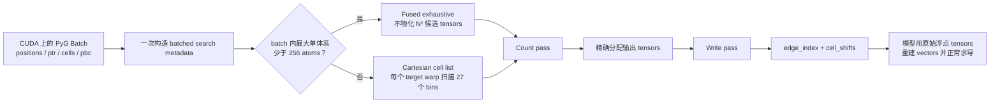

# 算法总览：为什么这个 Radius Graph Builder 快

本文是仓库的首要概览，面向希望快速判断方案价值、技术路线和适用边界的读者。实现细节见[当前设计](design.md)，完整测量方法见[真实材料 benchmark](benchmark.md)，问题修复与独立验证见[终审记录](review.md)。

## 一句话结论

这个实现没有发明新的 neighbor-search 数学，而是围绕 PyTorch CUDA batch 重新组织了成熟的 exhaustive search 与 cell-list 思想：小体系使用低启动成本的融合穷举，大体系切换到接近线性扩展的空间分桶，整个 batch 共用一套 CUDA pipeline，并避免 materialize 巨大的候选 tensors。它把“通用单体系邻居搜索”改造成了“模型入口处的专用批量图构造器”。

在一张 NVIDIA RTX PRO 6000 Blackwell GPU 上，最终实现对 1,536 个 `matbench_mp_e_form` 真实晶体组成的 DataLoader epoch 用时 36.584 ms，而逐体系 Vesin GPU 为 539.100 ms，前者快 14.74×；代表性的 32-structure batch 相对 Vesin 快 10.86×，相对 Equiformer/FairChem-style dense 构图快 47.07×。单个 64-atom 真实晶体仍快于 Vesin 1.60×，由该晶体派生的 32,768-atom supercell 快 3.88×。这些是特定硬件与 workload 上的工程证据，不是跨平台性能保证。

## 它解决的问题

等变原子图模型需要在 cutoff 内构造完整的有向 periodic atom-image graph。对每条 edge，除了 source 和 target atom index，还必须返回整数 cell shift；图不能跨越 batch member，必须保留 periodic self-images 和 small cell 中的 multiple images，并严格处理 triclinic cell、partial PBC、rank-deficient active lattice、cutoff boundary 与 autograd 边界。

传统 dense periodic 路径会为每个体系展开 `N² × periodic images` 候选，再在 GPU 上计算距离并过滤。小体系时这种方式简单有效，但候选数、显存和数据搬运会随 `N²` 快速增长。Vesin 已经是成熟高效的通用 neighbor-list library，但其公共调用模型以单体系为单位；神经网络训练中的 heterogeneous batch 会承担逐体系调用、同步和结果拼接成本。本项目的机会不在于重新发明物理，而在于针对 PyTorch batch 重新设计执行模型。

## 整体数据流

当前 crossover 按 batch 中最大的单体系判断：只有所有 structure 都少于 256 atoms 时才走 exhaustive，否则整个 batch 走 cell list。256 是在目标 Blackwell GPU 上根据小端与大端真实 workload 选择的 provisional heuristic，并非经过完整 threshold sweep 得到的数学常数；不同 GPU、cutoff、density 和 batch composition 可能需要重新标定。

## 六项核心优化

### 1. Batch-first，而不是逐体系循环

`ptr` 直接描述每个 structure 的 atom segment，不同 atom counts、cells 和 PBC patterns 可以进入同一次 CUDA launch sequence。GPU 不再为几十个小体系反复启动、同步和拼接；这也是完整真实 epoch 获得最大收益的主要来源。算法只在每个 segment 内产生 pairs，因此不会把整个 batch 的总 atom 数一起平方，更不会产生跨体系 edges。

### 2. 小体系使用真正轻量的融合穷举

小于 256 atoms 时，建立 cell list 的固定成本可能高于节省的距离计算。该路径把 `(source, target, periodic image)` 候选直接映射到 CUDA threads，用 block reduction 计数、block scan 写出，不先创建 `N² × images` 张量。复杂度仍是 `O(N²I)`，但中间内存很小、启动成本低，而且许多小体系能够共同填满 GPU。

### 3. 大体系切换到接近 O(N) 的 cell list

大体系先把 relevant periodic source images 插入边长等于 cutoff 的 Cartesian bins。每个 warp 负责一个 target atom，由前 27 个 lanes 分别扫描相邻 `3×3×3` bins，再执行精确距离判断。固定 density、cutoff 和平均邻居数时，工作量接近 `O(N + E)`，其中 `E` 是输出 edge 数；若物理输出本身达到 `O(N²)`，任何正确算法都无法绕过该下界。

### 4. 不构造“候选宇宙”

Equiformer/FairChem-style dense baseline 会 materialize batch-local `N²` pairs 和 padded periodic images。代表 batch 中，它额外占用约 6.9 GB PyTorch allocator memory，而本实现约为 1.5 MB；在 32,768 atoms 的派生 workload 上，dense candidate estimate 已接近 290 亿。新路径只保存 search metadata、bins、linked nodes 和最终 edges，避免先制造海量无效数据再删除。

### 5. Count、精确分配与错误状态共用同步点

Edge 数事先未知，因此实现先 count，再精确分配，最后 write。NaN/Inf、representative wrap 越界和最终 int32 shift 越界没有另开额外的 device-to-host 检查，而是编码进 count/prefix-sum 的状态 slot，通过本来就需要的 host read 一并返回。早期朴素验证曾让真实 epoch 回退约 22%；改成 O(N) per-atom preparation 与同步复用后，性能恢复而且仍能直接报错。

### 6. 用 profiler 否决“看起来更高级”的优化

Nsight 显示大体系最大的 device hotspot 是 wrapping 与 Cartesian bounds。曾尝试把融合 atomic bounds 换成独立 CUB reductions；虽然 wrapping kernel 从约 48 µs 降到约 1.6 µs，新增 reductions 却消耗约 105 µs，端到端反而变慢，因此立即撤销。最终优化选择由真实 wall time、显存和完整 correctness 共同决定，而不是由 kernel 名称或理论直觉决定。

## 与 Equiformer 和 Vesin 的关系

| 方案 | 主要执行单位 | 小体系 | 大体系 | 主要中间数据 | 定位 |
| --- | --- | --- | --- | --- | --- |
| Equiformer/FairChem periodic dense pattern | PyTorch batch | `N² × images` 展开 | 仍然展开 | 大型候选 tensors | 模型内通用张量实现 |
| Vesin GPU | 单个 structure | Auto 选择 | Cell list | Native backend data | 成熟通用 neighbor-list library |
| 本实现 | 整个 PyTorch batch | Fused exhaustive | Batched Cartesian cell list | 紧凑 metadata 与最终 edges | 面向模型入口的专用 CUDA builder |

本实现没有复制或移植 Vesin 源码。双方在大体系上采用 cell-list 这一标准算法家族，在小体系上也都认可“索引准备成本可能不值得”的基本原则；差异主要来自 batch-first execution、数据结构、periodic image 表示、kernel 分工、PyTorch stream/device 集成和固定 graph semantics。类似两个数据库都使用 B-tree，算法名称相同并不意味着数据流和吞吐相同。

## 真实性能证据

| Workload | 本实现 | Vesin GPU/structure | Equiformer-style dense |
| --- | --: | --: | --: |
| 1,536-structure DataLoader epoch | 36.584 ms | 539.100 ms | 因候选规模跳过 |
| 32-structure 代表 batch | 0.918 ms | 9.970 ms | 43.215 ms |
| 单个真实 64-atom 晶体 | 0.241 ms | 0.386 ms | 0.701 ms |
| 512-atom 派生 supercell | 0.305 ms | 0.641 ms | 6.675 ms |
| 1,728-atom 派生 supercell | 0.315 ms | 0.872 ms | 73.519 ms |
| 32,768-atom 派生 supercell | 0.414 ms | 1.607 ms | 候选约 290 亿，跳过 |

正式 benchmark 使用从 `matbench_mp_e_form` 确定性抽取的 1,536 个真实晶体，以标准 PyTorch DataLoader 组成 batch；大体系只通过一个真实 64-atom configuration 的整数 supercell repetition 派生。计时排除 DataLoader 与 H2D transfer，但包含公开 one-shot API 的 metadata、同步、输出分配和 CUDA 工作。它证明的是 graph-construction backend 的收益，不代表完整 Equiformer 模型会获得相同比例的端到端加速。

## 为什么适合在模型入口动态构图

推荐 Dataset 只保存 atomic numbers、positions、cell、PBC 和 labels；完整 batch 一次传到 GPU 后，由模型拥有的 graph builder 根据自身 cutoff 构图。这样 cutoff、self-edge policy 和 receptive field 不会污染 Dataset schema，数据增强、结构扰动、MD 和不同模型配置也不会读到 stale graph。代表 batch 的构图成本约 0.9 ms，在常见计算密集型 equivariant GNN 训练中通常只占 forward/backward 的小部分。

固定结构反复推理、极轻量模型或 CUDA Graph capture 可能需要 prepared metadata/workspace 或显式模型侧 cache，但它们应作为可选执行优化，而不是让 Dataset 永久携带 cutoff-specific graph。

## 为什么可以信任结果

Production CUDA output 不依赖 edge order，而是按完整 `(source, target,Sx,Sy,Sz)` key set 验证。独立 exhaustive PyTorch reference、ASE triclinic partial-PBC case、Vesin 0.6.1 外部 reference、26 项 unit tests、随机差分、autograd backward、non-default stream 和 CUDA memcheck 共同覆盖两条路径。全部 1,536 个真实结构、2,780,158 条 edge keys 与 Vesin 精确一致，代表 batch 的 43,842 条 keys 也与独立 dense baseline 一致。

## 已知边界

- 当前只提供 production CUDA backend，不提供 CPU backend、Verlet skin、neighbor cap、edge sorting、per-species cutoff、multi-GPU 或 `torch.compile`/export contract。
- Public `cell_shifts`、representative periodic wraps 和 cell-list nodes 使用 int32 可表达范围；越界直接报错，不进行静默截断或伪装成 int64 能力。
- One-shot API 每次重建一小部分 CPU metadata，并为精确输出大小发生同步；静态结构可能从 prepared metadata API 获益，但 ownership 与 mutation invalidation 需要先形成明确 contract。
- 极小非空 periodic cell 可能包含大量真实 periodic images，metadata 和输出会随物理 edge 数增长；这不是 neighbor-search 实现能够消除的冗余。
- 256-atom crossover 与本文所有 timings 都是当前 Blackwell workstation evidence；换 GPU 或 workload 后应重新测量，不应写成测试阈值或普适性能保证。

## 最终判断

这个方案的价值不是某一个神奇 kernel，而是一组相互配合的选择：小体系不为索引付费，大体系不为 `N²` 付费，多个体系不为逐个调用付费，内存不为无效候选付费，安全检查不增加无谓同步，优化不脱离真实材料与 profiler。它以更窄的通用性换取了 ELFES 模型入口这条关键路径上的高吞吐，同时用独立 reference、外部实现和完整真实数据把正确性与性能证据闭合起来。
