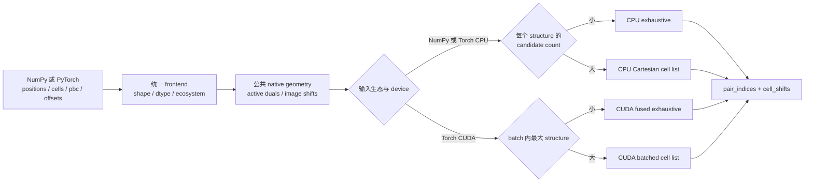

# 算法总览：为什么 tonari 快

本文面向希望快速判断方案价值、技术路线和适用边界的读者。精确 API 与数值约定见[设计文档](design.md)，完整测量方法见[真实材料 benchmark](benchmark.md)，correctness 修复与独立验证见[终审记录](review.md)。

## 一句话结论

`tonari` 没有发明新的 neighbor-search 数学，而是把 exhaustive search 与 Cartesian cell list 按 CPU、CUDA 和真实调用方式重新组织：小体系不为索引付费，大体系不为 `N²` 付费，CUDA batch 不为逐体系 launch 付费，CPU 不为 Python 小算子付费，NumPy 与 PyTorch 共享同一个 native CPU implementation。

在固定单核的 1,536-structure `matbench_mp_e_form` epoch 中，CPU 为 144.00 ms，公平复用的单线程 Vesin 为 248.46 ms，`tonari` 快 1.73×。在 RTX PRO 6000 Blackwell 的 `batch_size=32` epoch 中，CUDA 为 12.11 ms，逐 structure Vesin GPU 为 494.39 ms；代表性 32-structure batch 相对独立 Equiformer/FairChem-style dense baseline 快约 190×。补充的 QMugs finite-molecule workload 覆盖 8,192 个真实药物样分子、4–100 个重原子：CPU population epoch 与 Vesin 基本打平，CUDA `batch_size=64` epoch 快约 136×，代表 batch 相对 finite dense baseline 快 2.69×。这些是固定硬件、软件与 workload 的工程证据，不是跨平台保证。

## 问题本质

输入是一组 finite 或 periodic structures。对于每个 target，必须找到 cutoff 内所有 source images，并返回 source、target 与施加在 source 上的整数 cell shift。正确实现还必须处理 triclinic cell、partial PBC、rank-deficient inactive rows、periodic self-images、multiple images、strict cutoff boundary、未 wrap representatives、heterogeneous batch 和整数溢出。

最直接的 exhaustive search 枚举 `N² × periodic images`。它在小体系上极其高效，因为控制流简单且无需建索引，但原子数增长后会二次放大。Cell list 把空间分桶，在固定 density、cutoff 和平均邻居数时接近 `O(N + P)`，其中 `P` 是必须写出的 pair 数；代价是建表、内存初始化和间接访问。工程问题不是选一个“永远最好”的算法，而是在正确语义下选择交叉点，并把 Python/C++ boundary、metadata、allocation、synchronization 和 batch execution 一起纳入成本模型。

## 整体数据流

公共语义不随生态或 device 改变。NumPy frontend 只负责安全的 array-to-Tensor view/copy 决策并复用 CPU native path；Torch CPU 与 CUDA 共享 periodic metadata 和返回约定，但各自使用符合硬件成本模型的搜索实现。

## 主要优化技巧

### 1. 小体系直接穷举，不迷信渐近复杂度

CPU exhaustive 的实际工作量是 `N² × image_count`，因此 CPU 按每个 structure 的候选数切换，而不是只看 atom count。在真实 Matbench epoch 上扫描候选阈值后，16,384 附近最好；它能让常见小晶体走短而连续的循环，又避免 64-atom、many-image structure 被粗糙 atom threshold 误判。

CUDA 的成本模型不同。小体系需要的是足够并行度而不是避免每个 pair 的算术，因此当前以 batch 内最大 256 atoms 作为 fused exhaustive 与 cell-list pipeline 的 crossover。这个选择经过真实结构与 supercell 的开发期 sweep；它是当前硬件上的性能参数，不进入 public API，也不影响 pair identity。

### 2. 公共周期几何只做一次，而且在 native 边界完成

Active-row rank、dual vectors、image ranges 和 image shifts 对 CPU/CUDA 都相同。早期 Python/Torch metadata 把许多微小 tensor operations 重复 1,536 次，CPU epoch 一度约 286 ms；将最多 `3×3` 的线性代数与 image enumeration 合并进一次 C++ call 后，最终降到约 144 ms。性能收益主要来自消除 dispatcher、allocation 和 Python boundary，而不是某条神奇 SIMD 指令。

数值上，active rows 直接使用 long-double one-sided Jacobi SVD，不形成会平方条件数的 Gram matrix。Empty structure 在 rank/repeat/image enumeration 前短路。这样同一 metadata path 同时覆盖 finite、wire、slab、triclinic 与 full periodic structures。

### 3. CPU cell list 只插入真正相关的 source images

大体系先把 representatives wrap 到 active unit-cell directions，再建立 target Cartesian bounding box。只有落在 bounding box 外扩 cutoff 范围内的 periodic source images 才进入 linked nodes；每个 target 固定扫描相邻 `3×3×3` bins。它既不枚举全部 atom pairs，也不为离 target 区域很远的 images 建节点。

Dense bin heads 与紧凑 int32 linked nodes 减少内存和 pointer chasing。极端稀疏 finite coordinates 若会产生巨大的空 bin grid，则明确回退 exhaustive，优先保证内存安全。开发期曾加入 target-to-bin corner pruning，但独立 reviewer 在 `nextafter(cutoff, 0)` 附近复现了只保留一个方向的错误，而真实 workload 收益只有噪声量级，因此直接删除。

### 4. Broad phase 可以保守，最终 strict predicate 只能有一个

未 wrap representatives 会让 wrapped arithmetic 与 public displacement formula 在有限精度下出现不同消去。CPU cell list 因此按输入数量级构造保守搜索带，明显位于内侧的 candidate 可直接接受，边界壳必须以原始 `positions` 与最终 `cell_shifts` 重算 strict predicate；误差带过大时回退 exhaustive。

CUDA 选择更简单的正确性边界：cell-list prepare 一旦发现 nonzero representative wrap，整个调用复用已有的 exhaustive canonical predicate。它会让大规模未 wrap input 退化为 `O(N² × images)`，但避免维护第三套容易漂移的 cutoff 判断。正确性优先于一条只对病态输入更快、却难以证明一致的新路径。

Float32 的 strict boundary 还要求所有路径使用同一种舍入顺序。Host 先以 double 计算 `cutoff * cutoff`，再把 `cutoff_squared` 转为 geometry dtype 传入最终 predicate；不能在某个 kernel 中先把 cutoff 转为 float32 后再平方，否则 exhaustive/cell-list crossover 会在 1 ulp 边界改变 pair identity。

### 5. CUDA 把 batch 当作执行单位

`offsets` 把拼接的 positions 划分为独立 segments。CUDA metadata、bin layout、image insertion、count 和 write 都面向整个 heterogeneous batch 调度；不同 atom counts、cells 与 PBC patterns 可以共同占满 GPU，同时任何 pair 都只在自身 segment 内产生。

这正是相对 Vesin GPU 的主要差异。Vesin 一次处理一个 structure，真实 PyTorch batch 需要 Python loop、多个 launches 与拼接；`tonari` 把这些固定成本摊到一个 batch。相对 dense PyTorch baseline 的优势则来自不 materialize `N² × padded images` tensors。

### 6. Count 后精确分配，并把错误状态塞进必要同步

CUDA 事先不知道 `num_pairs`，因此先 count、prefix sum、精确分配，再 write。NaN/Inf、representative wrap 越界和 output shift 越界被编码进本来就需要读回的状态槽，避免为 validation 额外增加 device-to-host synchronization。CPU 使用 native vectors 收集，再一次性复制到精确大小的 outputs。

### 7. NumPy 不是第二套算法

NumPy input 在安全时通过 `torch.from_numpy` 与 native CPU backend 共享内存；frontend 只对 non-writeable、unaligned 或 negative-stride arrays 预先复制，native boundary 只在 layout 非 contiguous 时做必要 packing。Native code 与 correctness tests 完全复用，不存在“NumPy 版”和“PyTorch 版”长期漂移的问题。Output Tensor 的 CPU storage 直接导出为 NumPy arrays。

### 8. 连构建产物布局都必须用 wall time 验证

API 重命名后，CPU 算法对应 object file 的 `.text` bytes 与旧版逐字节相同，但文件名改变了 Ninja 的 link order，使热点 native code 地址整体移动，真实 epoch 从约 144 ms 回退到 165 ms；Vesin 同次测量保持约 248 ms，排除了系统噪声。同进程直接调用旧/新 extension 又把差异定位到 native search 的 117 vs 138 ms。

最终把共享 `periodic_geometry` 文件重命名为更自然的 `geometry`，让链接顺序成为 `bindings → geometry → neighbors`，热点函数地址恢复后正式 epoch 回到约 144.00 ms。这个案例很有代表性：高频微调用中，instruction-cache 与 branch-predictor aliasing 足以放大纯布局变化；“源码算法没变”不等于二进制性能没变。

## 与 Vesin 和 Equiformer-style dense baseline 的关系

| 方案 | 执行单位 | 小体系策略 | 大体系策略 | 主要定位 |
| --- | --- | --- | --- | --- |
| Equiformer/FairChem-style dense | PyTorch batch | `N² × images` tensor 展开 | 仍然 dense 展开 | 容易组合的模型内张量实现 |
| Vesin CPU/GPU | 单 structure | Auto 选择 | 成熟 cell list | 通用 neighbor-list library |
| tonari CPU | 单 structure 或 batch，内部逐 structure | Candidate-aware exhaustive | 单线程 Cartesian cell list | 低 boundary overhead；NumPy/Torch 共用 |
| tonari CUDA | 整个 Torch batch | Fused exhaustive | Batched warp cell list | 模型入口的高吞吐 neighbor search |

`tonari` 没有复制或移植 Vesin 源码。两者的大体系 CPU 路径都属于 cell-list 家族，小体系也都承认建索引未必值得；差异来自 periodic image 表示、data layout、crossover、Python boundary、batching 和实现成熟度。算法家族相同并不意味着执行成本相同。

## 真实性能证据

### CPU：真实单结构 DataLoader workflow

| Workload | tonari CPU | Vesin CPU reused | Vesin / tonari |
| --- | --: | --: | --: |
| 1,536-structure epoch | 143.999 ms | 248.459 ms | 1.73× |
| 真实结构，64 atoms | 0.0419 ms | 0.0454 ms | 1.08× |
| 派生 supercell，512 atoms | 0.2379 ms | 0.2296 ms | 0.97× |
| 派生 supercell，1,728 atoms | 1.1043 ms | 0.7152 ms | 0.65× |
| 派生 supercell，32,768 atoms | 24.0689 ms | 13.0912 ms | 0.54× |

CPU 的优势集中在真实数据中占多数的小结构与低固定成本；约 512 atoms 已接近当前单核交叉区，大体系 Vesin 更快。结论不是“我们在所有尺度击败 Vesin”，而是“统一 native frontend 在常见高频小体系 workflow 中值得拥有”。

### CUDA：真实 heterogeneous batch workflow

| Workload | tonari CUDA | Vesin GPU/structure | Dense baseline |
| --- | --: | --: | --: |
| 1,536-structure epoch | 12.107 ms | 494.393 ms | skipped |
| 32-structure 代表 batch | 0.2252 ms | 9.2855 ms | 42.7812 ms |
| 单个真实 64-atom 晶体 | 0.0969 ms | 0.3733 ms | 0.6898 ms |
| 32,768-atom 派生 supercell | 0.2539 ms | 1.4912 ms | 候选约 290 亿，跳过 |

Nsight 中 32,768-atom case 的所有 kernels 平均总计约 0.136 ms/call，20 次公开调用的 NVTX range 为 6.062 ms。相对旧二进制的提升主要位于 host/binding 路径；主要 GPU kernels 用时保持同一量级，因此不能把提升解释成遗漏了搜索工作。

### Finite molecules：QMugs workflow

QMugs population sample 保留真实大小分布，总原子数中位数为 52；另一组互不重复的 size-balanced sample 按重原子数分成八档，总原子数最高 221。每个 ChEMBL 分子只使用能量最低的 conformer，因此不会让同一分子的三个近似结构重复支配结果。

| Workload | tonari | Vesin | Dense baseline |
| --- | --: | --: | --: |
| CPU population epoch，4,096 molecules | 169.700 ms | 169.554 ms | — |
| CPU size-balanced epoch，4,096 molecules | 303.687 ms | 281.308 ms | — |
| CUDA population epoch，`batch_size=64` | 6.730 ms | 914.764 ms | skipped |
| CUDA population representative batch | 0.1128 ms | 14.1688 ms | 0.3031 ms |
| CUDA 81–100-heavy-atom representative batch | 0.1425 ms | 15.9462 ms | 0.7740 ms |

CPU 的趋势说明优势不是无限延伸：4–30-heavy-atom bins 上 `tonari` 领先 1.03–1.20×，31–40 档基本进入 crossover，之后 Vesin 的成熟 cell list 逐渐领先。自然分布 population epoch 恰好打平，刻意强化大分子的 size-balanced epoch 则由 Vesin 领先约 1.08×。CUDA 的主要收益来自一个 native call 处理完整 batch；`batch_size=8/32/64/128` 的 population epoch 时间从 45.471 降到 12.309、6.730、4.049 ms。Finite dense baseline 没有 periodic image padding，因此差距远小于晶体 workload，但随着分子变大仍从 2.43×扩大到 5.43×。

## 为什么适合在模型入口动态搜索

对于未来 PyG/GNN adapter，推荐 Dataset 只保存 atomic numbers、positions、cell、PBC 与 labels；batch 到达模型后，由模型拥有的 builder 根据自身 cutoff 调用 `find_neighbors`，再把 `pair_indices` 映射为 `edge_index`、把重建的 `displacements` 映射为 `edge_vectors`。这样 Dataset 不携带 ad hoc cutoff，数据增强、结构扰动、MD 和不同模型配置也不会读取 stale connectivity。

在 GPU 训练中，通常应先把 graph-free batch 一次传到 CUDA，再调用 CUDA backend。CPU backend 更适合 CPU inference、预处理/诊断、无 GPU 环境与 NumPy workflow。固定结构反复消费时 prepared metadata 可能有价值，但它需要明确 ownership、mutation invalidation 与 workspace lifetime，不应偷偷缓存 Tensor identity。

## 为什么可以信任结果

81 项 tests 覆盖 NumPy、Torch CPU、Torch CUDA、single/batch shapes、ecosystem mixing、长度单位一致缩放、finite/partial/full PBC、rank-deficient 与近共线 active rows、multiple images、periodic self-images、strict boundary、unwrapped representatives、int32/resource errors、autograd、non-default stream、独立 PyTorch reference、CPU-only benchmark import，以及 QMugs download resume/SDF/selection/cache 与 finite dense baseline。ASE 提供 triclinic partial-PBC reference。

正式 benchmark 在全部 1,536 个真实晶体、2,780,158 个完整 `(source, target, Sx, Sy, Sz)` keys，以及全部 8,192 个 QMugs 分子、15,144,842 个 keys 上让 CPU/CUDA 与 Vesin 精确一致；Matbench 与 QMugs representative CUDA batches 又分别在 43,842 和 1,322,646 个 keys 上与 dense baseline 精确一致。测试比较 key sets，不冻结 backend output order。

## 已知边界

- CPU search 当前单线程，batch 内 structures 顺序执行；调用方可在 DataLoader workers、进程池或 DDP 层并行。
- 大规模未 wrap CUDA input 可能回退 exhaustive；这是统一浮点语义的明确取舍。
- 极小非空 periodic cell 的真实 image/pair 数本身可能爆炸；resource guard 会提前拒绝不可控 metadata enumeration，但不能消除物理输出规模。
- One-shot API 每次重建 metadata 并为精确 output size 同步；prepared API 尚未设计。
- 当前只接受 scalar cutoff，不提供 species-dependent cutoff、neighbor cap、sorting、Verlet skin 或 GNN adapter。

真正的“独门技巧”不是某个神秘 kernel，而是始终把成本放在正确层次：候选规模决定算法，batch 决定 CUDA 调度，公共几何只实现一次，NumPy 复用 native CPU，错误检查复用必要同步，所有优化都必须同时通过真实材料 exact correctness 与 wall-time 证据。
