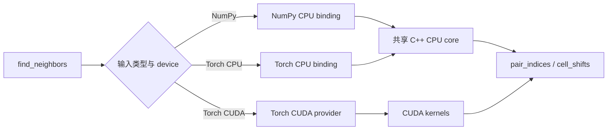

# 项目架构

本文介绍项目的代码如何分层，以及 NumPy、PyTorch、CPU 和 CUDA 如何组合。重点是各层的职责与依赖方向；具体几何约定和算法细节分别见[设计文档](design.md)与[算法总览](algorithm-overview.md)。项目目前暂用 `tonari` 作为包名，但核心实现不使用这个名称标记自身，未来改名不应牵动算法设计。

## 一条公共入口，三个执行路径

用户只调用 `find_neighbors(...)`。函数先根据 `positions` 判断输入属于 NumPy 还是 PyTorch，再由 PyTorch tensor 所在 device 选择 CPU 或 CUDA。三条路径共享完全相同的输入规则、pair 方向和 cutoff 语义。



这里没有一个同时懂所有框架的“大总管”。公共函数只负责分流；每个 frontend 只处理自己生态的输入；真正的搜索由 native implementation 完成。

## 四层职责

### 公共 API

`src/tonari/api.py` 定义唯一的 public function、类型标注和完整 docstring。它不构造 periodic images、不选择 exhaustive 或 cell-list 算法，也不创建 CUDA schedule。这样 public contract 与内部优化可以分别演进。

### Framework frontends

NumPy 与 PyTorch 各有一个很薄的 frontend。它们负责检查 array 类型、shape、dtype、device 和 `offsets`，把单结构输入规范化为 batch 形式，并在必要时整理为 contiguous memory。NumPy frontend 不导入 PyTorch；PyTorch frontend也不把 tensor 转成 NumPy。

### Native providers

Bindings 把 Python arrays 交给 native code，并把结果包装回调用者所属的生态。NumPy CPU 与 Torch CPU 使用不同 binding，但调用同一个 CPU core；因此它们不会复制两套搜索算法。Torch CUDA provider拥有 CUDA 所需的 metadata transfer、schedule 和算法选择，Python 看不到这些实现专用数据。

### Framework-neutral core

`csrc/core/` 只依赖 C++ 标准库。它不知道 Python、NumPy、PyTorch、Tensor 或 CUDA，负责公共 periodic geometry、pair policy 与 CPU neighbor search。这个边界既避免 NumPy 被迫承担 Torch runtime，也让 CPU 算法可以脱离 Python 单独编译和测试。

## 依赖方向

依赖只允许从外向内：public API 依赖 frontend，frontend 依赖对应 binding，binding 依赖 core 或 CUDA implementation。Core 绝不反向依赖任何 framework，NumPy 路径也不借道 Torch。CPU 与 CUDA 共享几何和 pair 语义，但不强求共享同一种执行算法，因为两类硬件适合的数据布局和调度方式不同。

这种组织有两个实际好处。第一，修复 periodic convention 或 half-list policy 时有明确的共同归属，不必在多个 frontend 复制规则。第二，性能优化可以留在所属 provider 内，例如 CUDA batch schedule不会泄漏成 Python API 的一部分。

## 目录结构

```text
src/tonari/
  api.py                 public API
  _numpy_frontend.py     NumPy validation and dispatch
  _torch_frontend.py     PyTorch validation and dispatch
  _extensions.py         lazy native-extension loading

csrc/
  core/                  framework-neutral geometry and CPU search
  numpy/                 NumPy binding
  torch/                 Torch CPU binding and CUDA provider
```

`_reference.py` 与 `_pairs.py` 是开发期 correctness 工具，不属于 public surface。Benchmarks 和 tests 只通过公共 API 测 production behavior；只有需要记录 native binary hash 等开发信息时才加载 private extension。

## 为什么现在这样分层

早期实现以 PyTorch 为中心，所以 NumPy 需要先包装成 Tensor，CUDA 的 metadata 与 schedule 也在 Python 中组装。功能增加后，这种结构会让 NumPy 无端依赖 Torch，并把 CUDA implementation details 暴露到 frontend。现在的分层把这两处耦合移除，同时保留一个简单的 public function，没有引入兼容 wrapper 或第二套 API。

这不是为了提前搭建复杂的发布框架，而是让当前代码已经具有清晰的所有权：输入适配属于 frontend，数组包装属于 binding，几何与 CPU 搜索属于 neutral core，CUDA 调度属于 CUDA provider。将来若增加 prepared search、其他 array ecosystem 或新的 accelerator，可以在这套边界上做独立设计，而不必继续扩大一个混合所有职责的模块。

## 包名与未来发布

当前项目名只应出现在 distribution metadata、Python package path 和面向用户的文档中；native namespace、算法对象、错误信息与源码注释使用中性术语。这样未来确定正式名称时，主要工作是替换发布与 import 边界，而不是重命名整套算法内部对象。

目前 source build仍需要 PyTorch 来编译 Torch providers，正式 wheel 的拆分方式、支持的 Python/PyTorch/CUDA matrix 和 binary distribution policy 留到真正准备发布时决定。这个尚未冻结的 packaging问题不会改变上述运行时边界：NumPy 调用不导入或链接 LibTorch，Torch 与 CUDA 能力通过各自 provider提供。
