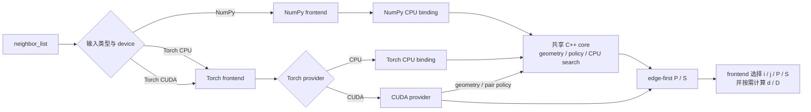

# 项目架构

本文解释 NumPy、PyTorch、CPU 和 CUDA 如何通过一个公共接口组合起来。算法本身见[算法总览](algorithm-overview.md)，精确输入输出规则见[设计文档](design.md)。

## 整体结构

用户只调用 `neighbor_list(...)`。公共 API 根据输入属于 NumPy 还是 PyTorch，以及 Torch tensor 位于 CPU 还是 CUDA，选择对应执行路径；`quantities` 决定最终 tuple 中包含哪些 arrays。



这个结构有两个核心目标：公共语义只定义一次，每个硬件后端仍能采用适合自己的执行方式。

## 各层职责

### 公共 API

`src/tonari/api.py` 定义 public function、类型标注和 docstring。它验证 `quantities` 与 `algorithm`、识别输入生态并交给相应 frontend，不构造 periodic metadata，也不执行 backend 的自动选择策略。

### Frontends

NumPy 与 PyTorch frontend 负责各自生态的 shape、dtype、device、batch 和 contiguous-memory 规则。它们把单结构输入规范化为统一的 batch 表示，并从 native `P/S` 组装请求的 quantities；`d/D` 使用原始浮点输入计算，frontend 不实现 neighbor search。

NumPy frontend 不导入 PyTorch；PyTorch frontend 也不会把 tensor 转成 NumPy。这样 NumPy 用户不需要承担 Torch runtime，两个生态之间也不存在隐式复制。

### Native bindings 与 providers

Bindings 负责把 Python arrays 映射到 native memory，并把结果包装回调用者所属的生态。NumPy CPU 与 Torch CPU binding 不共享 framework glue，但会调用同一个 C++ CPU core。

CUDA provider 负责 CUDA 特有的 geometry preparation、batch schedule、自动选择策略和 kernel launch。这些数据都是实现细节，不会穿过 public Python API。

### Framework-neutral core

`csrc/core/` 不依赖 Python、NumPy、PyTorch、Tensor 或 CUDA，负责公共 periodic geometry、pair policy 和 CPU search；thread-pool 层另外使用 POSIX fork hook，使子进程不继承失效的 worker 状态。因此 CPU 算法可以被不同 binding 直接复用。

CPU 和 CUDA 共享 pair 方向、cutoff、periodic shift 与 half/self 规则，但不强求使用相同的数据布局或调度方式。CPU core 还拥有 framework-neutral worker pool 和 source-major task/output model，使 NumPy 与 Torch CPU 不会形成两套并行实现。语义一致比实现表面一致更重要。

## 依赖方向

依赖始终从外向内：

```text
public API → frontend → binding/provider → core or CUDA implementation
```

Core 不反向依赖 frontend，NumPy 路径不借道 Torch，CUDA schedule 不暴露给 Python。这样的单向依赖让每类变化都有明确归属：接口变化留在 API，数组适配留在 frontend，物理规则留在 core，硬件优化留在 provider。

## 目录结构

```text
src/tonari/
  api.py                 public API
  _numpy_frontend.py     NumPy validation and dispatch
  _torch_frontend.py     PyTorch validation and dispatch
  _extensions.py         lazy extension loading

csrc/
  core/                  shared geometry, pair policy, CPU search and thread pool
  numpy/                 NumPy binding
  torch/                 Torch bindings and CUDA provider
```

独立 brute-force reference 位于 `tests/`，benchmark adapters 位于 `benchmarks/`；它们不会进入安装包。Benchmarks 和 tests 原则上通过公共 API 观察 production behavior。

## 对未来发布的意义

当前包名只出现在 distribution metadata、Python import path 和用户文档中；native namespace、算法对象、错误信息与源码注释使用中性术语。因此以后即使更换项目名，也不需要重命名整个算法实现。

当前源码构建保持一个 `tonari` distribution。NumPy CPU 与 Torch CPU providers 始终构建；Torch CUDA 默认构建，并可通过 `BUILD_CUDA=0` 明确关闭。构建不会因环境探测失败而静默降级。每次构建记录 Torch、CUDA 和 provider 信息，provider loader 在导入 native extension 前检查兼容性。安装命令和精确行为见[源码构建](source-builds.md)。

正式 wheel 的构建与发布策略尚未决定，但不需要为此提前改变公共 API 或 framework-neutral core。未来增加新 provider 或 prepared search 时，应继续遵守现有边界，而不是扩大公共 API 对内部实现的了解。
